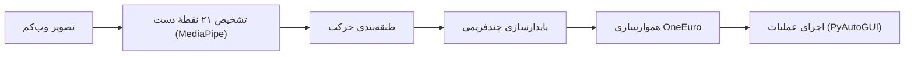

# 🖐️ Hand Mouse Control


**نشانگر ماوس را با حرکت دست کنترل کنید — فقط با یک وب‌کم معمولی، بدون هیچ سخت‌افزار اضافه‌ای**

این پروژه با کمک مدل تشخیص نقاط کلیدی دست از **MediaPipe** گوگل، دست شما را در تصویر زندهٔ وب‌کم دنبال می‌کند، شکل انگشت‌ها را با یکی از چند حرکت از‌پیش‌تعریف‌شده تطبیق می‌دهد و در نهایت با کتابخانهٔ **PyAutoGUI** همان حرکت را به جابه‌جایی نشانگر، کلیک، درگ، اسکرول، زوم و چند عملیات دیگر روی سیستم‌عامل تبدیل می‌کند. کاملاً چندسکویی نوشته شده و روی ویندوز، مک‌اواس و لینوکس اجرا می‌شود.



## دانلود

اگر نمی‌خواهید درگیر نصب پایتون و وابستگی‌ها بشوید، ساده‌ترین راه استفاده از نسخه‌های آماده‌اجراست که در صفحهٔ [Releases](https://github.com/rstagit/air-mouse/releases) این مخزن منتشر می‌شوند. در حال حاضر آخرین نسخه **v1.0.0** است و برای هر سه سیستم‌عامل به‌صورت خودکار بیلد شده:

| سیستم‌عامل | فایل | حجم تقریبی |
|---|---|---|
| ویندوز (x86_64) | [HandMouseControl-windows-x86_64.zip](https://github.com/rstagit/air-mouse/releases/download/v1.0.0/HandMouseControl-windows-x86_64.zip) | ≈۱۱۰ مگابایت |
| مک‌اواس (Apple Silicon / arm64) | [HandMouseControl-macos-arm64.zip](https://github.com/rstagit/air-mouse/releases/download/v1.0.0/HandMouseControl-macos-arm64.zip) | ≈۱۰۶ مگابایت |
| لینوکس (x86_64) | [HandMouseControl-linux-x86_64.zip](https://github.com/rstagit/air-mouse/releases/download/v1.0.0/HandMouseControl-linux-x86_64.zip) | ≈۱۵۹ مگابایت |

فایل مربوط به سیستم‌عامل خودتان را دانلود کنید، از حالت فشرده خارج کنید و اجرا کنید — نیازی به نصب پایتون یا هیچ‌کدام از وابستگی‌ها نیست. (حجم فایل‌ها زیاد به‌نظر می‌رسد ولی طبیعی است؛ MediaPipe و OpenCV به‌تنهایی حجم قابل‌توجهی دارند، همان‌طور که در بخش [ساخت فایل exe](#ساخت-فایل-exe) هم توضیح داده‌ام.)

اگر ترجیح می‌دهید از سورس اجرا کنید، در کد دست ببرید، یا خودتان یک بیلد بسازید، ادامهٔ همین راهنما را دنبال کنید.

## فهرست مطالب

- [دانلود](#دانلود)
- [ویژگی‌ها](#ویژگی‌ها)
- [پیش‌نیازها](#پیش‌نیازها)
- [نصب](#نصب)
- [شروع سریع](#شروع-سریع)
- [راهنمای حرکت‌های دست](#راهنمای-حرکت‌های-دست)
- [میان‌برهای صفحه‌کلید](#میان‌برهای-صفحه‌کلید)
- [آرگومان‌های خط فرمان](#آرگومان‌های-خط-فرمان)
- [تنظیمات](#تنظیمات)
- [ساختار پروژه](#ساختار-پروژه)
- [اجرای تست‌ها](#اجرای-تست‌ها)
- [ساخت فایل exe](#ساخت-فایل-exe)
- [عیب‌یابی](#عیب‌یابی)
- [نکات ایمنی](#نکات-ایمنی)
- [مشارکت](#مشارکت)
- [مجوز](#مجوز)

## ویژگی‌ها

- 🖱️ حرکت نشانگر کاملاً متناسب با حرکت دست شماست؛ فیلتر هموارسازی OneEuro هم لرزش‌های ریز دست را می‌گیرد تا حرکت نرم و طبیعی بماند.
- 🤏 پینچ شست و اشاره یعنی کلیک؛ نگه‌داشتنش یعنی درگ. پینچ شست با انگشت وسط راست‌کلیک است، و نزدیک‌کردن هر سه انگشت به هم دابل‌کلیک.
- 📜🔍 با اشارهٔ شست اسکرول می‌کنید، و با پینچ هم‌زمان دو دست زوم (معادل Ctrl + اسکرول) — دور شدن دست‌ها از هم بزرگ‌نمایی است، نزدیک شدنشان کوچک‌نمایی.
- ⏯️ حرکت شاکا (🤙) پخش یا توقف رسانه را کنترل می‌کند.
- 🎯 یک حالت دقیق هم هست، برای وقتی که نشانگر باید آهسته‌تر و با ریزبینی بیشتر حرکت کند.
- 🖥️ یک جاروب سه‌انگشتی دسکتاپ مجازی را عوض می‌کند؛ در حالت ارائه همان حرکت، اسلاید را ورق می‌زند.
- 🔒 یک حرکت اختصاصی هم هست که با نگه‌داشتنش صفحه قفل می‌شود.
- 🔴 حالت لیزر پوینتر مخصوص ارائه و سخنرانی است: کنترل واقعی ماوس موقتاً کنار می‌رود و فقط یک نقطهٔ قرمز روی نوک اشاره‌تان شناور می‌ماند.
- ♿ برای دسترس‌پذیری بیشتر، کلیک با درنگ (Dwell Click) هم پیاده‌سازی شده.
- 🧙 یک ویزارد کالیبراسیون خودکار، آستانه‌های تشخیص را متناسب با اندازهٔ دست و فاصله‌تان تا دوربین تنظیم می‌کند.
- تصویر دوربین در یک ترد جداگانه خوانده می‌شود تا اجرای برنامه روان‌تر باشد، و 🧪 یک مجموعه تست واحد کامل هم با pytest نوشته شده.

## پیش‌نیازها

قبل از هر چیز این‌ها را آماده داشته باشید:

- **پایتون ۳٫۹ یا بالاتر** (این پروژه را با نسخهٔ ۳٫۱۲ ساختم و آزمایش کردم)
- یک **وب‌کم** (داخلی یا USB، فرقی نمی‌کند)
- اتصال اینترنت در اولین اجرا (برای دانلود خودکار مدل تشخیص دست)
- و البته وابستگی‌های پایتون، که در `requirements.txt` فهرست شده‌اند:

  | کتابخانه | کاربرد |
  |---|---|
  | `opencv-python` | خواندن تصویر دوربین و رسم روی آن |
  | `mediapipe` | تشخیص ۲۱ نقطهٔ کلیدی دست با یادگیری ماشین |
  | `pyautogui` | کنترل واقعی نشانگر ماوس، کلیک و صفحه‌کلید سیستم |
  | `numpy` | محاسبات برداری برای طبقه‌بندی حرکت |

### مجوزهای سیستم‌عامل

- **ویندوز:** اگر دسترسی دوربین برای اپ‌های دسکتاپ مسدود بود، از مسیر Settings → Privacy & Security → Camera فعالش کنید.
- **مک‌اواس:** چون PyAutoGUI مستقیماً ماوس و صفحه‌کلید را کنترل می‌کند، باید در System Settings → Privacy & Security → Accessibility دسترسی لازم را به ترمینال (یا فایل exe ساخته‌شده) بدهید؛ دسترسی دوربین هم باید تأیید شود.
- **لینوکس:** کاربر باید عضو گروه `video` باشد (`sudo usermod -aG video $USER` و بعد یک بار خروج و ورود دوباره). PyAutoGUI روی لینوکس به Tkinter هم نیاز دارد؛ اگر نصب نباشد موقع اجرا خطا می‌گیرید، پس بهتر است از قبل نصبش کنید:

  ```bash
  sudo apt-get install python3-tk python3-dev
  ```

## نصب

سه مرحلهٔ ساده دارد:

```bash
# ۱. کلون یا دانلود این مخزن، سپس ورود به پوشهٔ آن
cd hand-mouse-control

# ۲. ساخت محیط مجازی (پیشنهادی)
python -m venv venv

# فعال‌سازی محیط مجازی:
# ویندوز (Command Prompt):
venv\Scripts\activate.bat
# ویندوز (PowerShell):
venv\Scripts\Activate.ps1
# مک‌اواس / لینوکس:
source venv/bin/activate

# ۳. نصب وابستگی‌ها
pip install -r requirements.txt
```

## شروع سریع

```bash
python hand_mouse_control.py
```

- در **اولین اجرا**، مدل تشخیص دست (`hand_landmarker.task`، چند مگابایت) به‌طور خودکار دانلود می‌شود.
- بلافاصله بعد، **ویزارد کالیبراسیون دو مرحله‌ای** اجرا می‌شود:
  1. حدود ۱٫۵ ثانیه دست را کاملاً باز و انگشت‌ها را از هم باز نگه دارید.
  2. حدود ۱٫۵ ثانیه شست و اشاره را به هم بچسبانید (پینچ کنید).
- از روی همین دو نمونه، آستانه‌های تشخیص متناسب با اندازهٔ دست و فاصله‌تان تا دوربین تنظیم و در `config.json` ذخیره می‌شود، تا در اجراهای بعدی دوباره لازم نباشد.
- پنجره‌ای با عنوان **Hand Mouse Control** باز می‌شود که تصویر آینه‌ای دوربین را همراه با اسکلت دست و اطلاعات وضعیت (HUD) نشان می‌دهد.

## راهنمای حرکت‌های دست

این جدول دقیق‌ترین مرجع است برای این‌که هر حرکت دقیقاً چه کاری انجام می‌دهد:

| حرکت | شکل دست | عملکرد |
|---|---|---|
| **حرکت پیش‌فرض** | دست باز، یا هر حالت نامنطبق با موارد زیر | حرکت نشانگر ماوس |
| **کلیک / درگ** | نوک شست به نوک اشاره بچسبد (پینچ) | تک‌کلیک؛ اگر نگه دارید، پس از حدود ۰٫۲۵ ثانیه به درگ تبدیل می‌شود |
| **راست‌کلیک** | نوک شست به نوک انگشت وسط بچسبد | راست‌کلیک |
| **دابل‌کلیک** | شست + اشاره + وسط هر سه به هم نزدیک شوند | دابل‌کلیک |
| **اسکرول بالا** | مشت بسته با شست رو به بالا (👍) | اسکرول به بالا |
| **اسکرول پایین** | مشت بسته با شست رو به پایین (👎) | اسکرول به پایین |
| **پخش/توقف رسانه** | شست و انگشت کوچک باز، سه انگشت میانی جمع (🤙) | پخش یا توقف موقت رسانه |
| **حالت دقیق** | علامت V با اشاره و وسط، نگه‌داشته‌شود (✌️) | حرکت آهسته‌تر و دقیق‌تر نشانگر |
| **جارو سه‌انگشتی** | اشاره + وسط + حلقه باز، دست سریع به چپ یا راست کشیده شود | تعویض دسکتاپ مجازی (یا ورق‌زدن اسلاید در حالت ارائه) |
| **قفل صفحه** | فقط انگشت وسط باز (بقیه جمع)، حدود ۱٫۵ ثانیه نگه‌داشته شود | قفل صفحه |
| **زوم دو دستی** | هر دو دست هم‌زمان پینچ کنند و از هم دور/نزدیک شوند | دور شدن = بزرگ‌نمایی، نزدیک شدن = کوچک‌نمایی |
| **لیزر پوینتر** | (با کلید `l` فعال می‌شود، حرکت دست خاصی ندارد) | نقطهٔ قرمز شناوری روی نوک اشاره نمایش می‌دهد و کنترل واقعی ماوس را موقتاً معلق می‌کند — مناسب ارائه |

> **نکته:** نشانگر تنها در حرکت پیش‌فرض، حالت دقیق و هنگام درگ جابه‌جا می‌شود؛ در بقیهٔ حرکت‌ها (اسکرول، راست‌کلیک و غیره) نشانگر در جای خود ثابت می‌ماند.

## میان‌برهای صفحه‌کلید

این کلیدها هنگام باز بودن پنجرهٔ برنامه فعال هستند:

| کلید | عملکرد |
|---|---|
| `Space` | توقف موقت / ازسرگیری کنترل ماوس |
| `h` | نمایش یا مخفی‌کردن راهنمای کامل حرکت‌ها روی تصویر |
| `p` | فعال/غیرفعال‌کردن حالت ارائه (جارو سه‌انگشتی → ورق‌زدن اسلاید به‌جای تعویض دسکتاپ) |
| `l` | فعال/غیرفعال‌کردن حالت لیزر پوینتر |
| `d` | فعال/غیرفعال‌کردن کلیک با درنگ |
| `c` | اجرای دوبارهٔ ویزارد کالیبراسیون |
| `q` یا `Esc` | خروج از برنامه |

## آرگومان‌های خط فرمان

چند آرگومان هم موقع اجرا در دسترس‌تان است:

```bash
python hand_mouse_control.py [آرگومان‌ها]
```

| آرگومان | توضیح |
|---|---|
| `--camera N` | استفاده از دوربین با اندیس `N` (این مقدار را جای `camera_index` در `config.json` می‌نشاند) |
| `--list-cameras` | نمایش اندیس تمام دوربین‌های در دسترس و خروج |
| `--calibrate` | اجرای اجباری ویزارد کالیبراسیون، حتی اگر قبلاً انجام شده باشد |
| `--config PATH` | استفاده از یک فایل تنظیمات دیگر به‌جای `config.json` پیش‌فرض |

## تنظیمات

همهٔ رفتار برنامه از فایل `config.json` خوانده می‌شود (که کالیبراسیون هم آن را به‌روزرسانی می‌کند). این فایل به‌طور خودکار ساخته می‌شود و در `.gitignore` قرار دارد، چون نتیجهٔ کالیبراسیونِ مخصوص دستگاه شماست؛ اگر می‌خواهید تنظیمات پایه را به اشتراک بگذارید، از `config.example.json` استفاده کنید.

مهم‌ترین پارامترهای قابل‌تنظیم:

| کلید | پیش‌فرض | توضیح |
|---|---|---|
| `camera_index` | `0` | اندیس دوربین مورد استفاده |
| `cam_width` / `cam_height` / `cam_fps` | `640` / `480` / `30` | رزولوشن و نرخ فریم دوربین |
| `pinch_ratio` | `0.35` | آستانهٔ فاصلهٔ شست-اشاره برای تشخیص پینچ (عدد کوچک‌تر یعنی سخت‌گیرانه‌تر) |
| `stability_frames` | `5` | تعداد فریمی که برای پایدار شدن یک حرکت با رأی‌گیری بررسی می‌شود |
| `drag_activation_delay_s` | `0.25` | مدت نگه‌داشتن پینچ پیش از تبدیل کلیک به درگ (ثانیه) |
| `scroll_step` | `18` | میزان اسکرول در هر رویداد |
| `precision_factor` | `0.35` | ضریب کاهش سرعت نشانگر در حالت دقیق |
| `enable_dwell_click` / `dwell_time_s` | `false` / `1.2` | فعال‌سازی و زمان‌بندی کلیک با درنگ (بدون نیاز به پینچ) |
| `media_playpause_key` | `"playpause"` | نام کلید PyAutoGUI برای پخش/توقف؛ اگر پخش‌کننده پاسخ نداد، به `"space"` تغییرش دهید |
| `enable_right_click` / `enable_double_click` / `enable_media_control` / `enable_zoom` | `true` | روشن/خاموش کردن هر حرکت به‌طور جداگانه |

## ساختار پروژه

اگر می‌خواهید توی کد سرک بکشید، این نقشهٔ فایل‌هاست:

| فایل | توضیح |
|---|---|
| `hand_mouse_control.py` | نقطهٔ ورود اصلی؛ حلقهٔ خواندن دوربین، تشخیص حرکت و اجرای عملیات |
| `gesture_engine.py` | منطق طبقه‌بندی حرکت‌های دست بر پایهٔ نقاط کلیدی MediaPipe |
| `camera.py` | خواندن تصویر وب‌کم در ترد جداگانه برای روانی بیشتر |
| `calibration.py` | ویزارد دومرحله‌ای کالیبراسیون |
| `config.py` | تعریف، بارگذاری و ذخیرهٔ تنظیمات |
| `platform_actions.py` | عملیات مخصوص هر سیستم‌عامل (قفل صفحه، تعویض دسکتاپ، کلید رسانه، زوم) |
| `rendering.py` | رسم HUD/راهنما روی تصویر دوربین و پنجرهٔ شناور لیزر پوینتر |
| `smoothing.py` | فیلتر OneEuro برای هموارسازی حرکت نشانگر |
| `config.example.json` | نمونهٔ فایل تنظیمات با مقادیر پیش‌فرض |
| `requirements.txt` | فهرست وابستگی‌های پایتون |
| `tests/` | مجموعه تست‌های واحد (pytest) |

## اجرای تست‌ها

برای اجرای مجموعهٔ تست‌ها:

```bash
pip install pytest
pytest tests/
```

## ساخت فایل exe

اگر فقط می‌خواهید از برنامه استفاده کنید و درگیر کدش نشوید، لازم نیست این بخش را دنبال کنید — نسخه‌های آماده‌اجرای هر سه سیستم‌عامل در بخش [دانلود](#دانلود) هست. این بخش برای کسانی است که می‌خواهند خودشان یک فایل exe بسازند یا بدانند فرایند بیلد خودکار پشت صحنه دقیقاً چه‌کار می‌کند.

برای این‌که برنامه روی رایانه‌ای بدون پایتون نصب‌شده هم اجرا شود، می‌توان آن را با **PyInstaller** در یک فایل exe مستقل بسته‌بندی کرد.

> ⚠️ **توجه:** PyInstaller قابلیت کامپایل متقاطع ندارد؛ یعنی برای ساخت exe ویندوزی، باید این مراحل را **مستقیماً روی ویندوز** اجرا کنید (از لینوکس یا مک نمی‌توان exe ویندوزی ساخت). روند زیر را دقیقاً روی همین پروژه آزمایش کردم تا از صحت فلگ‌ها مطمئن شوم؛ فقط پلتفرم ساخت آزمایش من لینوکس بود، نه ویندوز.

### ۱. نصب PyInstaller

در همان محیط مجازی پروژه:

```bash
pip install pyinstaller
```

### ۲. ساخت فایل exe

```bash
pyinstaller --onefile --name HandMouseControl --collect-all mediapipe hand_mouse_control.py
```

توضیح فلگ‌ها:

- `--onefile`: پایتون، تمام کتابخانه‌ها و وابستگی‌ها را در یک فایل exe واحد بسته‌بندی می‌کند.
- `--name`: نام فایل خروجی را تعیین می‌کند.
- `--collect-all mediapipe`: **الزامی است.** کتابخانهٔ mediapipe فایل‌های دادهٔ داخلی زیادی دارد که PyInstaller به‌طور پیش‌فرض تشخیص نمی‌دهد؛ بدون این فلگ، فایل exe ساخته‌شده هنگام اجرا با خطای import مواجه می‌شود. (این مورد را مستقیماً روی این پروژه آزمایش و تأیید کردم.)

پس از چند دقیقه، فایل در مسیر `dist/HandMouseControl.exe` قرار می‌گیرد. در آزمایش من (ساخت روی لینوکس، صرفاً برای اطمینان از صحت روند بسته‌بندی) حجم خروجی حدود **۱۶۸ مگابایت** شد؛ روی ویندوز هم به‌دلیل حجم بالای مدیاپایپ و OpenCV، انتظار داشته باشید فایل نهایی معمولاً بین **۱۵۰ تا ۲۵۰ مگابایت** باشد — این کاملاً طبیعی است.

### نکات مهم

**۱. ماندگاری کالیبراسیون و مدل دانلودی (اصلاحی که در کد اعمال شده):**
در حالت `--onefile`، PyInstaller هنگام اجرا محتوای برنامه را در یک پوشهٔ موقت باز می‌کند و در پایان کار همان پوشه را پاک می‌کند. کد اولیهٔ پروژه، مسیر `config.json` و مدل `hand_landmarker.task` را با `__file__` محاسبه می‌کرد که در حالت exe به همین پوشهٔ موقتِ پاک‌شدنی اشاره می‌کند — یعنی بدون اصلاح، در نسخهٔ exe کالیبراسیون و مدلِ دانلودشده در **هر اجرا از نو گم می‌شدند**. این مورد را مستقیماً آزمایش و تأیید کردم و در فایل‌های `config.py` و `hand_mouse_control.py` با یک تابع کوچک به نام `app_dir()` اصلاح کرده‌ام: این تابع وقتی برنامه به‌صورت exe اجرا شود، `config.json` و مدل را کنار خودِ فایل exe ذخیره می‌کند (نه پوشهٔ موقت)، تا بین اجراها باقی بمانند. این دو فایل اصلاح‌شده همراه README در خروجی قرار گرفته‌اند.

**۲. هشدار آنتی‌ویروس/Windows Defender:**
چون فایل exe امضای دیجیتال (code signing) ندارد، ممکن است در اولین اجرا با هشدار «Windows protected your PC» یا شناسایی نادرست به‌عنوان بدافزار روبه‌رو شوید. این یک False Positive رایج در فایل‌های ساخته‌شده با PyInstaller است. برای ادامه، روی «More info → Run anyway» بزنید.

**۳. اجرای بدون کنسول (اختیاری):**
اگر نمی‌خواهید پنجرهٔ کنسول سیاه پشت برنامه دیده شود:

```bash
pyinstaller --onefile --windowed --name HandMouseControl --collect-all mediapipe hand_mouse_control.py
```

توجه داشته باشید که با این حالت، پیام‌های متنی برنامه (مثل خطای «دوربین یافت نشد») دیگر نمایش داده نمی‌شوند؛ برای اشکال‌زدایی، نسخهٔ کنسول‌دار را نگه دارید.

**۴. آیکون سفارشی (اختیاری):**

```bash
pyinstaller --onefile --icon=app.ico --name HandMouseControl --collect-all mediapipe hand_mouse_control.py
```

**۵. توزیع بین چند کامپیوتر:**
برای این‌که کاربران نیازی به دانلود مجدد مدل نداشته باشند، می‌توانید فایل `hand_landmarker.task` را از یک اجرای موفق کپی کرده و کنار `HandMouseControl.exe` قرار دهید.

**۶. جایگزین گرافیکی:** اگر با خط‌فرمان راحت نیستید، بستهٔ [`auto-py-to-exe`](https://pypi.org/project/auto-py-to-exe/) یک رابط گرافیکی روی همین PyInstaller ارائه می‌دهد و همان فلگ‌های بالا را از طریق تیک‌زدن گزینه‌ها اعمال می‌کند.

## عیب‌یابی

چند مشکل رایج و راه‌حلشان:

- **دوربین پیدا نمی‌شود:** با `python hand_mouse_control.py --list-cameras` اندیس دوربین‌های در دسترس را ببینید و آن را با `--camera N` مشخص کنید.
- **تشخیص حرکت نادرست یا خیلی حساس/بی‌حس است:** یک‌بار دیگر کالیبراسیون را با کلید `c` یا فلگ `--calibrate` اجرا کنید.
- **نشانگر می‌لرزد:** معمولاً کالیبراسیون دوباره کافی است؛ برای تنظیم دستی‌تر می‌توانید `oneeuro_beta` و `oneeuro_mincutoff` را در `config.json` تغییر دهید.
- **کلید پخش/توقف رسانه اثر ندارد:** مقدار `media_playpause_key` را در `config.json` به `"space"` تغییر دهید.
- **روی لینوکس با خطای مربوط به Tkinter مواجه می‌شوید:** دستور `sudo apt-get install python3-tk python3-dev` را اجرا کنید.
- **روی مک‌اواس نشانگر اصلاً حرکت نمی‌کند:** دسترسی Accessibility را طبق بخش [پیش‌نیازها](#پیش‌نیازها) بدهید.
- **دقت تشخیص در برخی محیط‌ها پایین است:** نور یکنواخت و پس‌زمینهٔ نسبتاً ساده، دقت تشخیص دست را به‌طور محسوسی بهتر می‌کند.

## نکات ایمنی

چون این برنامه نشانگر و برخی کلیدهای سیستم را به‌طور مستقیم و خودکار کنترل می‌کند، از همان ابتدا چند لایهٔ ایمنی در کد جا گذاشته‌ام:

- **توقف اضطراری:** بردن نشانگر ماوس به هر یک از چهار گوشهٔ صفحه‌نمایش، قابلیت Fail-Safe کتابخانهٔ PyAutoGUI را فعال و بلافاصله برنامه را متوقف می‌کند.
- **مکث آنی:** با کلید `Space` در هر لحظه می‌توانید کنترل ماوس را موقتاً غیرفعال کنید.
- **رهاسازی خودکار درگ:** اگر دست از دید دوربین خارج شود یا برنامه را مکث کنید، هر درگِ در حال انجام بلافاصله رها می‌شود تا دکمهٔ ماوس «گیر» نکند.
- **سقف زمانی درگ:** حتی اگر تشخیص حرکت گیر کند، هیچ درگی بیش از ۶ ثانیه ادامه پیدا نمی‌کند (قابل تنظیم با `grab_max_hold_s`).

پیشنهادم این است که پیش از استفادهٔ جدی، یک‌بار با تنظیمات پیش‌فرض و در محیطی بدون کار مهمِ درحال‌انجام امتحانش کنید و بعد با شرایط خودتان کالیبره‌اش کنید.

## مشارکت

مشارکت‌ها خوش‌آمدند. اگر تغییری آماده کرده‌اید، پیش از ارسال Pull Request این را

```bash
pytest tests/
```

اجرا کنید و مطمئن شوید همه‌چیز سبز است. لطفاً تغییرات را کوچک و متمرکز نگه دارید و برای هر حرکت یا رفتار جدید، تست مربوطه را هم اضافه کنید.

## مجوز

این پروژه تحت مجوز **MIT** منتشر شده. متن کامل را در فایل [LICENSE](LICENSE) ببینید.
